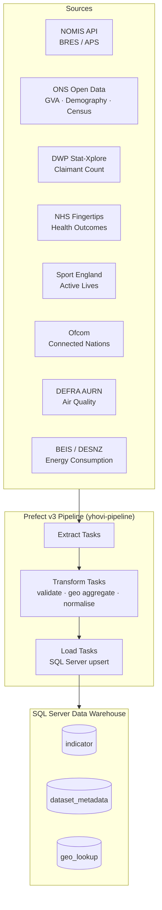

# Yorkshire Vitality Observatory — ETL Pipeline

> **YHODA** — Yorkshire Health & Opportunity Data Architecture
> A Prefect v3 pipeline that collects, transforms, and warehouses socioeconomic,
> health, and environmental indicators for all 22 Yorkshire Local Authority Districts.

---

## Architecture



### Domain flows

| Domain | Flows | Primary sources |
|--------|-------|-----------------|
| **Economy** | employment-jobs, claimant-count, business-demography, gdp-gva | NOMIS, DWP, ONS |
| **Society** | health-outcomes, education-attainment, housing-tenure, deprivation-imd, crime-statistics, physical-activity, digital-inclusion | Fingertips, DfE, ONS, Home Office, Sport England, Ofcom |
| **Environment** | air-quality, energy-consumption | DEFRA, BEIS |

All 13 deployments run on the first of each month at 06:00 Europe/London.

---

## Quickstart

### Prerequisites

- Python 3.11+
- [`uv`](https://github.com/astral-sh/uv) package manager
- SQL Server (or Azure SQL) instance with the target database created
- Self-hosted Prefect v3 server (`PREFECT_API_URL`)
- ODBC Driver 18 for SQL Server

### 1. Clone and install

```bash
git clone https://github.com/your-org/YHODA.git
cd YHODA
uv sync --extra dev
```

### 2. Configure environment

```bash
cp .env.example .env
# Edit .env with your real credentials
```

### 3. Run database migrations

```bash
uv run alembic upgrade head
```

### 4. Register deployments with Prefect

```bash
uv run prefect deploy --all --no-prompt
```

### 5. Verify

```bash
# Confirm the package imports correctly
uv run python -c "from yhovi_pipeline.config import get_settings; print('ok')"

# Lint
uv run ruff check src/ tests/

# Tests
uv run pytest
```

---

## Environment Variables

| Variable | Required | Default | Description |
|----------|----------|---------|-------------|
| `SQL_SERVER_CONNECTION_STRING` | **Yes** | — | SQLAlchemy pyodbc URL for the data warehouse |
| `DWP_API_KEY` | **Yes** | — | DWP Stat-Xplore API key |
| `NOMIS_API_KEY` | No | `None` | NOMIS API key (public endpoints work without one) |
| `PREFECT_API_URL` | **Yes** | — | URL of your self-hosted Prefect server |
| `PREFECT_WORK_POOL` | No | `yhovi-default` | Prefect work pool name |
| `LOG_LEVEL` | No | `INFO` | Python logging level |

---

## Project Structure

```
YHODA/
├── src/
│   └── yhovi_pipeline/
│       ├── config.py              # pydantic-settings Settings + get_settings()
│       ├── db/
│       │   ├── models.py          # SQLAlchemy 2.0 ORM (Indicator, DatasetMetadata, GeoLookup)
│       │   └── migrations/        # Alembic migration scripts
│       ├── flows/
│       │   ├── economy/           # employment_jobs, claimant_count, business_demography, gdp_gva
│       │   ├── society/           # health_outcomes, education_attainment, housing_tenure,
│       │   │                      #   deprivation_imd, crime_statistics, physical_activity,
│       │   │                      #   digital_inclusion
│       │   ├── environment/       # air_quality, energy_consumption
│       │   └── orchestrator.py    # full-refresh flow-of-flows
│       ├── tasks/
│       │   ├── extract/           # nomis, ons, dwp, fingertips, sport_england, ofcom, defra, beis
│       │   ├── transform/         # geo, validate, normalise
│       │   └── load/              # sql_server
│       └── utils/                 # logging, metadata, geo_lookups
├── tests/
│   ├── conftest.py                # test_settings fixture
│   ├── unit/
│   └── integration/
├── data/                          # raw downloads (gitignored)
├── docs/
├── .github/workflows/ci.yml       # lint → test → deploy
├── prefect.yaml                   # 13 deployments
├── alembic.ini
├── pyproject.toml
└── .env.example
```

---

## How to Add a New Data Source

1. **Create an extract task** in `src/yhovi_pipeline/tasks/extract/<source>.py`.
   Follow the existing pattern: `@task(name="extract/<source>/...", retries=3)`.

2. **Create a flow** in the appropriate domain directory
   (`flows/economy/`, `flows/society/`, or `flows/environment/`).
   Use `@flow(name="<domain>/<name>", task_runner=ThreadPoolTaskRunner(...))`.

3. **Register the deployment** in `prefect.yaml` following the existing pattern.

4. **Write tests** in `tests/unit/` for your transform logic.

5. **Generate a migration** if new ORM columns are needed:
   ```bash
   uv run alembic revision --autogenerate -m "add <description>"
   uv run alembic upgrade head
   ```

6. Open a PR — CI will lint, test, and (on merge to `main`) deploy automatically.

---

## Development

```bash
# Lint + format
uv run ruff check src/ tests/
uv run ruff format src/ tests/

# Type check
uv run mypy src/

# Tests with coverage
uv run pytest --cov=src/yhovi_pipeline

# Alembic migration
uv run alembic revision --autogenerate -m "describe change"
uv run alembic upgrade head
uv run alembic downgrade -1   # roll back one revision
```

---

## Licence

See [LICENSE](LICENSE).
